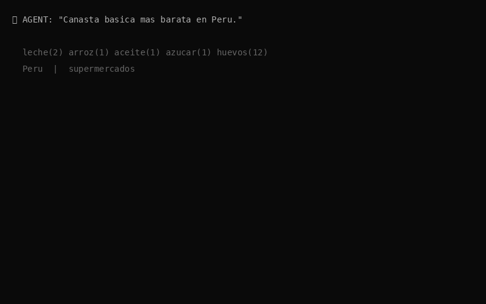
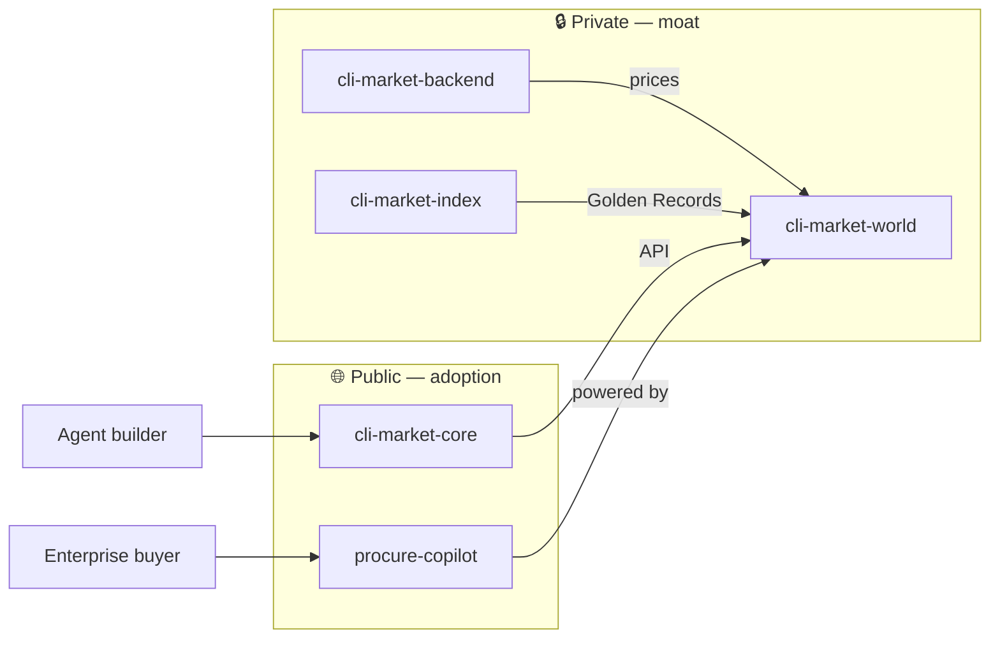

<div align="center">

# Ricardo Cuba

### Founder · [CLI Market](https://cli-market.dev) · [Sinapsis Innovadora](https://github.com/Treevu-ai/sinapsis-innovadora)

**Commerce infrastructure for AI agents** — one API, CLI & MCP to search, compare and buy across LATAM retail.

🇵🇪 Perú · turning shelf prices into agent decisions

<br/>

<a href="https://cli-market.dev">
  
</a>

<br/>

[](https://cli-market.dev)
[](https://cli-market-production.up.railway.app/dashboard)
[](https://pypi.org/project/cli-market/)
[](https://cli-market.dev/tools)
[](https://cli-market.dev/#pro-checkout)

```bash
pip install cli-market
market search "arroz" --country PE --json
market compare "leche" --country PE
```

</div>

---

## What I'm building

| Signal | Live today |
|:---|:---|
| Shelf prices | **50,000+** verified · refresh ~4h |
| Retailers | **38** active · **68** defined |
| Platforms | VTEX · Shopify · Magento · WooCommerce |
| Countries | 8 · AR BR CL CO FR IT MX PE |
| Golden Records | **11,000+** product identities · **92%** linkage |
| Agent surface | **22** curated MCP tools · REST · CLI |

---

## Business model → repo visibility

Open where we **win adoption & B2B demos**. Private where the **data moat** lives.

| Layer | Repo | | Who it's for |
|:---|:---|:---:|:---|
| **SDK / funnel** | [cli-market-core](https://github.com/Treevu-ai/cli-market-core) | 🌐 | Devs & agents — `pip install` → register → search |
| **B2B showcase** | [procure-copilot](https://github.com/Treevu-ai/procure-copilot) | 🌐 | Procurement teams on CLI Market data |
| **Product moat** | cli-market-world | 🔒 | API, landing, MCP registry, ops |
| **Data moat** | cli-market-backend | 🔒 | Collector, connectors, billing |
| **Semantic moat** | cli-market-index | 🔒 | Golden Record entity resolution |
| **GTM ops** | cli-market-content | 🔒 | Calendar, drafts, campaign gates |



> Private repos: request access via [cli-market.dev](https://cli-market.dev) · Pro **$39/mo** for alerts, full MCP & checkout.

---

## Stack

```text
Agents     MCP · tool calling · RAG · agentic workflows
Backend    Python · FastAPI · PostgreSQL
Frontend   Next.js · React · Tailwind
Commerce   VTEX APIs · PayPal · Mercado Pago · PyPI
Cloud      Railway · Cloudflare · GitHub Actions · Azure
```

<details>
<summary><b>Also shipping</b></summary>

<br/>

| Project | Focus |
|:---|:---|
| [sinapsis-innovadora](https://github.com/Treevu-ai/sinapsis-innovadora) | Agentic digital transformation studio |
| [treevu-ai-repo-landing](https://github.com/Treevu-ai/treevu-ai-repo-landing) | Company landing & product catalog |

</details>

---

<div align="center">

### GitHub


<br/>

[](https://www.linkedin.com/in/ricardo-antonio-cuba-alvan)
[](https://x.com/cli_market_dev)
[](mailto:hello@cli-market.dev)

<sub>Pin suggestion: <code>cli-market-core</code> · <code>procure-copilot</code> · private moat repos · <code>sinapsis-innovadora</code></sub>

<br/><br/>

*"Agents need a place to shop. We built the aisle."*

</div>