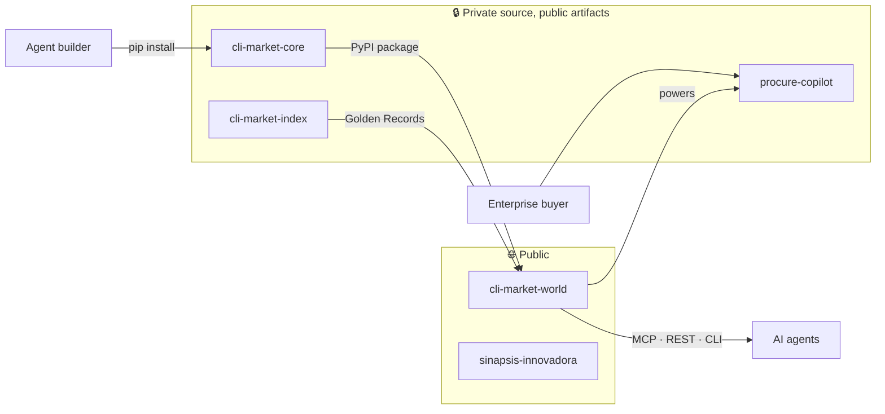

<div align="center">


# Ricardo Cuba

### Founder · [CLI Market](https://cli-market.dev) · [Sinapsis Innovadora](https://github.com/Treevu-ai/sinapsis-innovadora)

**Commerce infrastructure for AI agents** — one API, CLI & MCP to search, compare and buy across LatAm retail.

🇵🇪 Lima, Perú · turning shelf prices into agent decisions, live in 20+ countries

<br/>

<!-- readme-hero -->
<a href="https://cli-market.dev">
  
</a>

<br/><br/>

[](https://cli-market.dev)
[](https://pypi.org/project/cli-market/)
[](https://pypi.org/project/cli-market-core/)
[](https://cli-market.dev/tools)
[](https://cli-market.dev/#pro-checkout)

```bash
pip install cli-market
market search "arroz" --country PE --json
market optimize "leche(2) arroz(1) aceite(1)" --country PE
```

</div>

---

## What's live right now

*Pulled straight from the moat, not a slide deck.*

| Signal | Live today |
|:---|:---|
| Shelf prices tracked | **180,000+** snapshots · refresh every ~4h |
| Retailers | **320+** indexed · VTEX · Shopify · WooCommerce · Magento · Bsale |
| Countries | **20+** — 🇵🇪🇦🇷🇧🇷🇨🇱🇨🇴🇲🇽🇪🇨🇬🇹🇺🇾🇨🇷🇵🇦🇧🇴🇵🇾 + 🇪🇸🇮🇹🇫🇷🇩🇪🇳🇱🇬🇧🇺🇸 |
| Product identities | **150,000+** resolved · golden-record cross-store linkage |
| Agent surface | **68** MCP tools · REST API · CLI |
| Basket optimizer | 1 call → best split across retailers, TCO, substitutes, checkout links |

---

## Business model → repo visibility

Open where we **win adoption & B2B demos**. Private where the **data moat** lives.

| Layer | Repo | | Who it's for |
|:---|:---|:---:|:---|
| **Product / API / ops** | [cli-market-world](https://github.com/Treevu-ai/cli-market-world) | 🌐 | The canonical monorepo — API, MCP registry, collector, landing |
| **B2B showcase** | [sinapsis-innovadora](https://github.com/Treevu-ai/sinapsis-innovadora) | 🌐 | Agentic transformation studio & client work |
| **Intelligence layer** | cli-market-core | 🔒 → [PyPI](https://pypi.org/project/cli-market-core/) | Source private, package public — `pip install` still works |
| **Procurement control plane** | procure-copilot | 🔒 | Approval workflows & checkout for LatAm procurement teams |
| **Semantic moat** | cli-market-index | 🔒 | Golden Record entity resolution |
| **GTM ops** | cli-market-content | 🔒 | Calendar, drafts, campaign gates |



> Private repos: request access via [cli-market.dev](https://cli-market.dev) · Pro **$39/mo** for alerts, full MCP & checkout.

---

## Stack

```text
Agents     MCP · tool calling · agentic workflows · RAG
Backend    Python · FastAPI · PostgreSQL
Frontend   Next.js · React · Tailwind
Commerce   VTEX · Shopify · WooCommerce APIs · PayPal · Mercado Pago
Cloud      Fly.io · Cloudflare · GitHub Actions
```

<details>
<summary><b>Also shipping</b></summary>

<br/>

| Project | Focus |
|:---|:---|
| [sinapsis-innovadora](https://github.com/Treevu-ai/sinapsis-innovadora) | Agentic digital transformation studio |
| [treevu-ai-repo-landing](https://github.com/Treevu-ai/treevu-ai-repo-landing) | Company landing & product catalog |
| [invisible-hand](https://github.com/Treevu-ai/invisible-hand) | Market automation engine — signal-driven microservices |

</details>

---

<div align="center">

### GitHub


<br/>

[](https://www.linkedin.com/in/ricardo-antonio-cuba-alvan)
[](https://x.com/cli_market_dev)
[](mailto:hello@cli-market.dev)

<sub>Pin suggestion: <code>cli-market-world</code> · <code>sinapsis-innovadora</code> · private moat repos on request</sub>

<br/><br/>

*"Agents need a place to shop. We built the aisle."*

</div>
